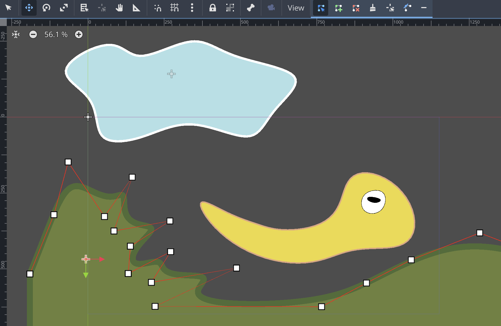

# Godot B-Spline Plugin

Plugin for creating B-Spline based shapes. It allows you to

- create and edit the b-spline points and weights in the editor
- create open or closed shapes
- create clamped open shapes
- select spline degree
- select rendering detail
- choose border width and color
- choose fill color or texture
- specify virtual shape extension for creating floors and ceilings
- auto-create collision polygon

The Example folder contains a scene with procedural generated ground, hills and mountains; and some spline clouds.
See interactive demo: https://tripod.itch.io/splines

## Screenshots

